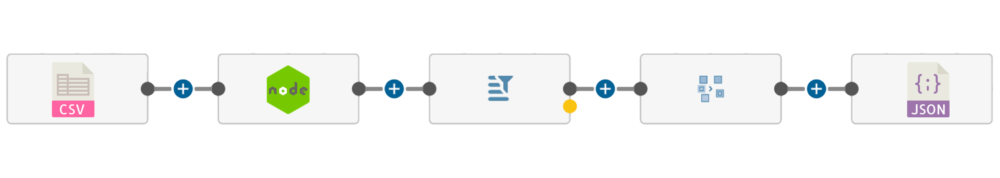

# Easy CSV

Easy convert from CSV file to JSON

This NPM provides a way to convert from simple CSV file to JSON with/without metadata

## How to install.

```bash
npm install easy-csv
```

### Simple use

```typescript
import { EasyCSV, EasyCSVInput } from 'easy-csv/lib';

// ...

const fs = require('fs');

const filePath = './my-file.csv';
fs.readFile(filePath, null, (err: any, nb: any) => {
  const ab = nb.buffer;
  EasyCSV.convert({
    file: ab,
    charSep: ',',
    headers: false,
    metadata: false,
  } as EasyCSVInput).then((data) => console.log(data));
});
```

### Parameter options

| Parameter | type        | description                            |
| --------- | ----------- | -------------------------------------- |
| file      | ArrayBuffer | CSV file BufferArray                   |
| charSep   | string      | Char separator                         |
| headers   | boolean     | The file contains headers true / false |
| metadata  | boolean     | Show metadata in the output JSON       |

## Status

Project is: _in progress_
Thank you for using this font

## TODO

- Add more symbols
- Build a Spanish ordered version

## Stay in touch

- Author - Luis Arias 2020 <ariassd@gmail.com> - [GitHub profile](https://github.com/ariassd)

## License

This font is free for personal and commercial use. You are free to copy and transmit this typeface.

This typeface is licensed under [MIT License](LICENSE)\
 

November 2020
